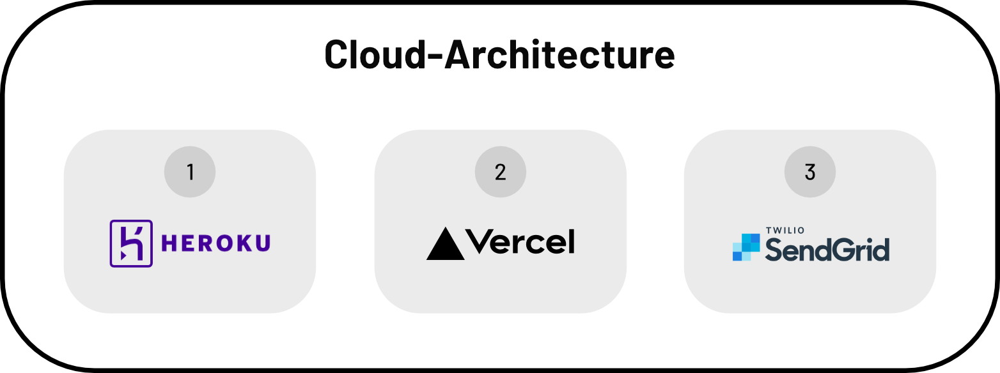

# Nusszopf Backend

Local instance of hasura to manage and version changes for multiple environments.

## Docs

- [Environments](./docs/environments.md)
- [Export GraphQL Schema](./docs/schema.md)
- [101](./docs/101.md)

## Cloud & Services

### 1. Heroku

Heroku is used to host the backend-container-environments for production and staging.

### 2. Vercel

Vercel is used to host the frontend web-applications and all serverless functions for custom backend-logic.

### 3. SendGrid

SendGrid is used for e-mail-marketing.
